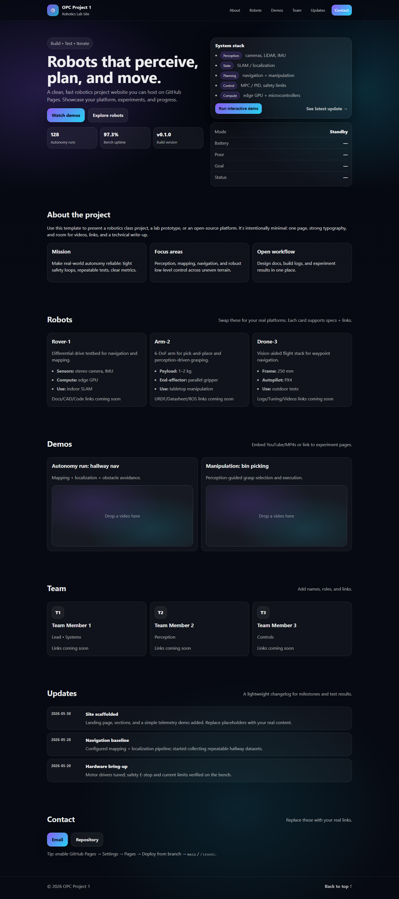
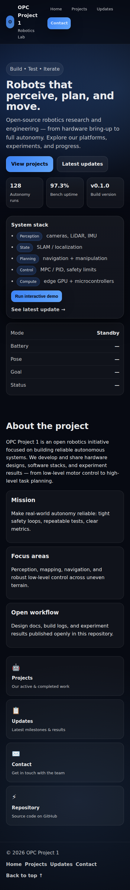

# opc-project-1 — Robotics Website

A simple, fast, one-page robotics project website built with **vanilla HTML/CSS/JS**, designed to deploy cleanly on **GitHub Pages**.

## Overview

This repo contains a polished single-page site you can use for a robotics team, lab, or project:

- Sectioned landing page (About / Robots / Demos / Team / Updates / Contact)
- Responsive layout and modern styling
- Small interactive “telemetry” demo in the browser

## Screenshots



<details>
<summary>Mobile preview</summary>


</details>

## Features

- **Fast + lightweight:** no framework, minimal JavaScript
- **Responsive:** looks good on desktop and mobile
- **Easy to edit:** update content directly in `index.html`
- **GitHub Pages friendly:** deploy from `main` with a couple clicks

## Run locally

### Option A: Open the file

Open `index.html` in your browser.

### Option B (recommended): Run a tiny local server

```bash
python -m http.server 8000
```

Then visit: <http://localhost:8000>

## Deploy (GitHub Pages)

1. Go to **Settings → Pages**
2. Under **Build and deployment** choose:
   - **Source:** Deploy from a branch
   - **Branch:** `main`
   - **Folder:** `/(root)`
3. Save — Pages will publish the site.

### HTTPS / TLS certificate

- For GitHub Pages, TLS certificates are managed by GitHub (Let's Encrypt) and renewed automatically.
- Keep **Enforce HTTPS** enabled in **Settings → Pages**.
- If you use a custom domain, set repository variable `SITE_HOST` to that hostname so the TLS check workflow validates the production certificate.

Manual verification:

```bash
npm run check:tls -- your-domain.example
```

This verifies:
- certificate chain validity (`Verify return code: 0 (ok)`)
- certificate expiration date

Automated verification is configured in `.github/workflows/tls-certificate-check.yml` and runs weekly (plus manual `workflow_dispatch`).

## Customization checklist

Common edits in `index.html`:

- [ ] Project/team name + tagline
- [ ] About section copy
- [ ] Robots list (names, specs, status)
- [ ] Demo links (videos, papers, repositories)
- [ ] Team roster (names, roles, links)
- [ ] Updates/timeline items
- [ ] Contact info (email, socials)

Optional tweaks:

- [ ] Update colors/typography in `styles.css`
- [ ] Adjust the telemetry demo behavior in `script.js`
- [ ] Replace the favicon (`assets/favicon.svg`) and/or add your own images in `assets/`
